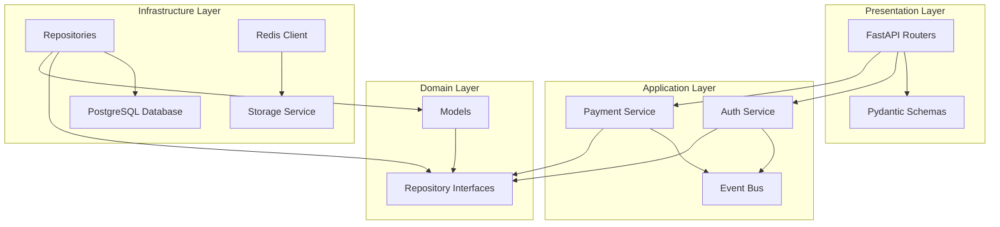

# System Architecture & Technical Specifications

This document outlines the core architecture, software design decisions, and technology stack of the LavoroHub platform.

## Technology Stack

### Frontend
- **Framework:** Next.js (React) + TypeScript
- **UI & Styling:** Tailwind CSS + Lucide Icons
- **State Management:** Zustand
- **Data Fetching:** TanStack Query (React Query)
- **Forms & Validation:** React Hook Form + Zod

### Backend
- **Framework:** Python 3.13+ with FastAPI
- **Architecture:** Clean Architecture + Repository Pattern + Dependency Injection
- **ORM:** SQLAlchemy 2.x
- **Database Migrations:** Alembic
- **Logging:** Loguru (prepared for Sentry integration)

### Infrastructure
- **Primary Database:** PostgreSQL
- **Caching & Rate Limiting:** Redis
- **Reverse Proxy & Web Server:** Nginx (with Gzip compression & static file caching)
- **Containerization:** Docker & Docker Compose

---

## Technical Architecture

The backend follows the principles of **Clean Architecture**, enforcing strict unidirectional dependency flows.

- **Domain Layer:** Pure business entities (SQLAlchemy models) and repository interfaces. Contains no external dependencies.
- **Application Layer:** Core business rules (services, event routing, background jobs, external adapters).
- **Infrastructure Layer:** Database access implementation (repositories), storage providers (local storage/S3), cache, and geocoding services.
- **Presentation Layer:** FastAPI routes, input validation schemas (Pydantic), and global rate-limiting middlewares.
