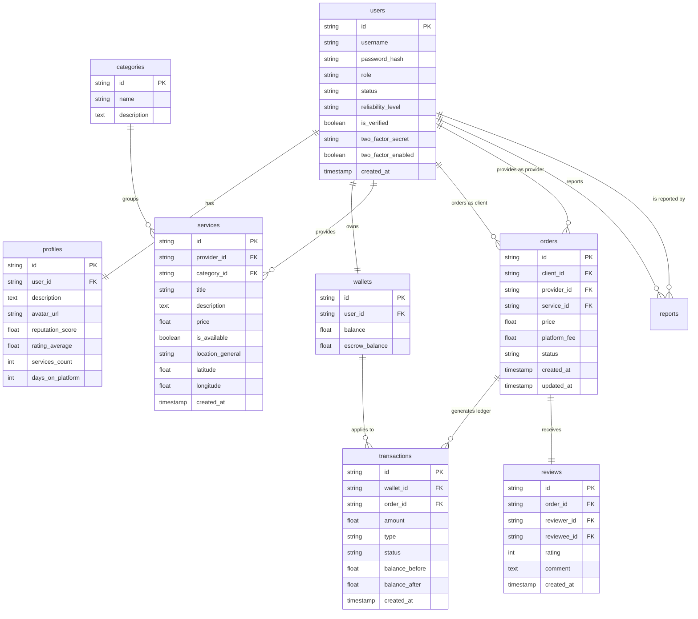

# Database Design & Schema

LavoroHub utilizes **PostgreSQL** as its transactional engine, structured around a highly normalized relational database design to guarantee absolute data consistency and integrity.

## Entity-Relationship Diagram

The core entities are mapped using the following schema structure:

## Key Architectural Constraints
- **Ledger Immutability:** Any transaction recorded in the `transactions` table represents a non-modifiable record. Corrections or cancellations must be written as a separate offset/reversing transaction.
- **Cascading & Set Null Rules:** Relationships are carefully configured with safety in mind (e.g. services map to Category with `ondelete="SET NULL"`, avoiding cascade drops of active services if a category is edited).
