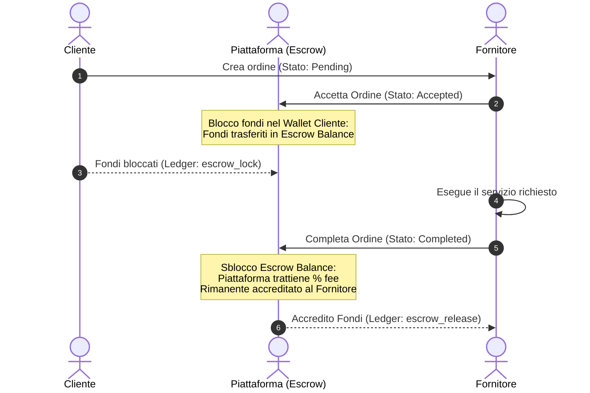

# Escrow Financial Flows & Commission Ledger

This document defines the strict workflow for payments, commission retention, and escrow protection on LavoroHub.

## Escrow Lock & Release Cycle

To maximize safety for both client and service provider, LavoroHub acts as an intermediary custodian of funds during active jobs.

## Immutable Ledger Properties

Every movement of capital (deposits, escrow placements, platform commissions, refunds) must generate a permanent record in the `transactions` table.

### Audit Trial Fields
Each entry captures:
- **UUID:** Globally unique transaction identifier.
- **Wallet ID:** Targeted wallet context.
- **Order ID:** Associated contract/order.
- **Type:** e.g., `deposit`, `escrow_lock`, `escrow_release`, `refund`.
- **Amount:** Value of transaction.
- **Balance Before:** Balance state immediately prior to transaction.
- **Balance After:** Resulting wallet balance.
- **Created At:** Precise, server-side UTC timestamp.
